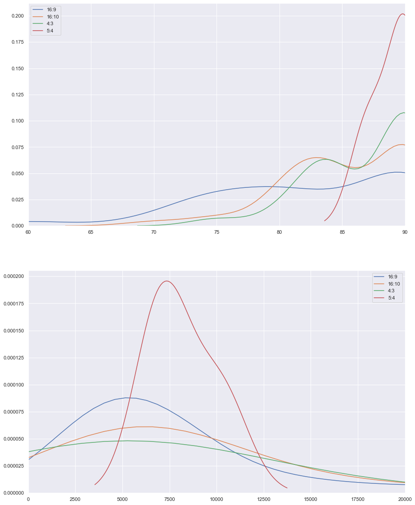

# RainbowSixPlots
Analysis of pro-player mouse sensitivities in the videogame 'Rainbow Six Siege' using matplotlib &amp; seaborn for graphs and data from http://www.r6prosettings.net/.

Using configurations from around 250 professional R6S players, I calculated a single sensitivity value for each of them based on their DPI, sensitvity multiplier (usually 0.02 or 0.00223), their vertical mouse sensitivity (as horizontal varies with aspect resolution), and their ADS sensitvity multiplier.

This image shows the normalized sensitivity distribution for the players. To find a specific setting like vertical sensitvity, take a value on the x axis and divide it by every other field. For example, say you have a DPI of 1000, a sensitvity multiplier of 0.00223, and an ADS multiplier of 50, and you want to find the vertical sensitvity the number 6000 on the x axis corresponds to, you calculate it as follows: 6000/1000/0.00223/50 = 54. This means that to get the same vertical sensitvity as other players with a normalized value of 6000, set your vertical sensitvity to 54.

This image shows KDE plots (like histograms but smooth) for the FOV (field of view) (left) and normalized sensitivity (right) used by pro players at different aspect ratios.

